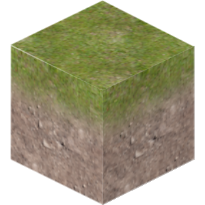
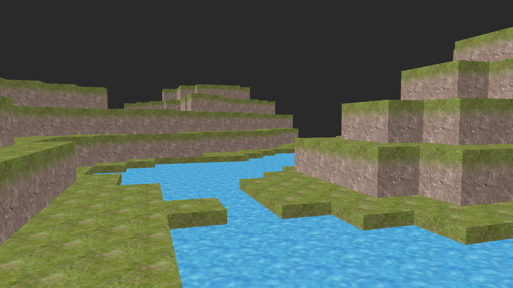
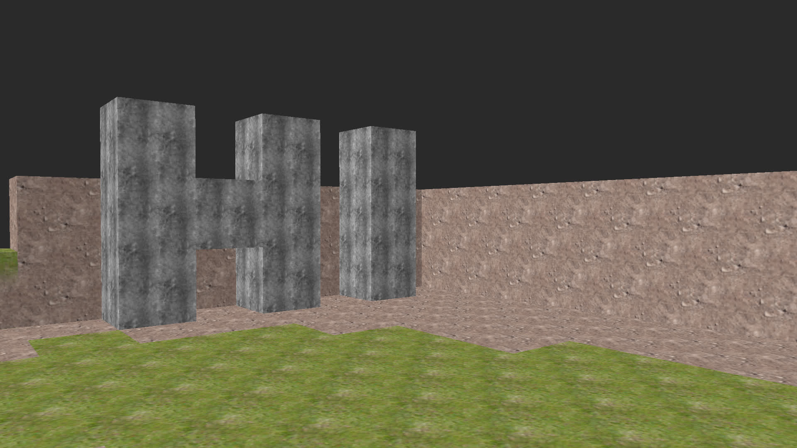
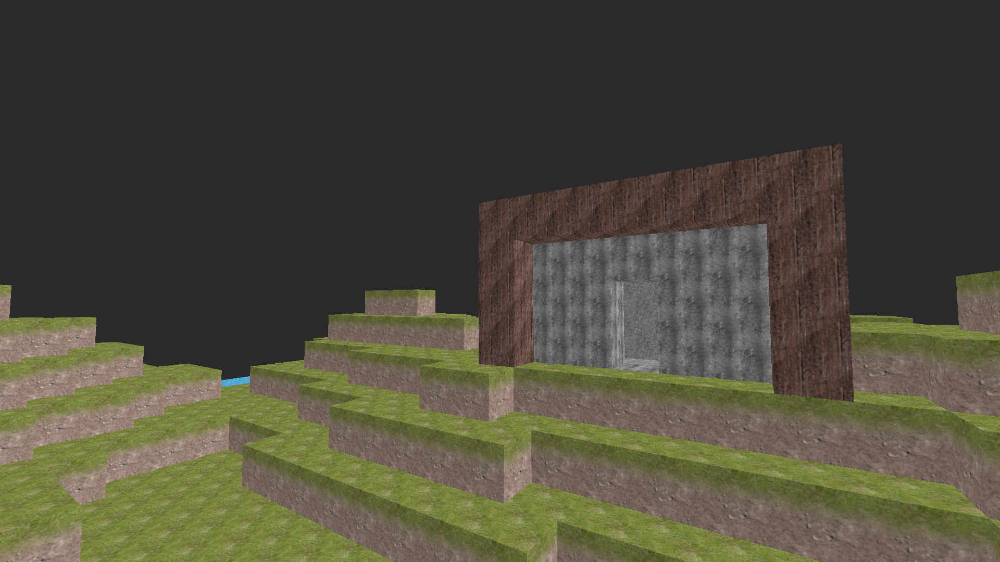
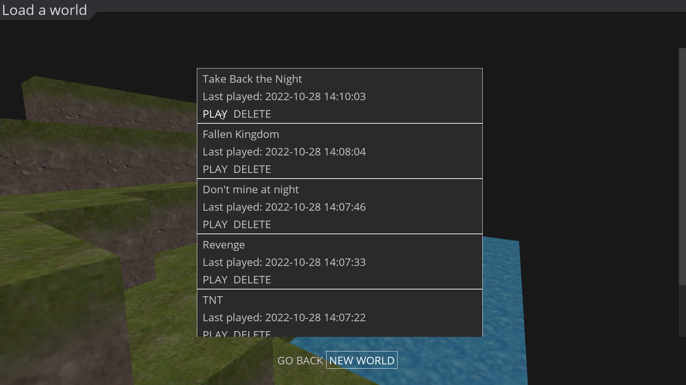

# Voxel Engine

A simple 3D voxel game made in Python with [ModernGL](https://github.com/moderngl/moderngl).

## Features

- First person controls

- Seed-based, procedurally generated infinite world

- Block breaking and block placing

- Infinite amount of saves, similar to Minecraft

- In-game settings

- Sounds

## Installation

1. Clone the repository `git clone https://github.com/TriLinder/VoxelEngine.git`

2. Install the requirements from `requirements.txt`

3. Run `main.py`

## System keybinds

Most keybinds can be changed from the settings, however, some system keybinds can not.

These are:

| KEY   | FUNCTION             |
| ----- | -------------------- |
| `ESC` | Pause the game       |
| `DEL` | Quit the application |
| `F11` | Toggle fullscreen    |
| `F1`  | Hide the UI          |
| `F2`  | Take a screenshot    |

## Screenshots

